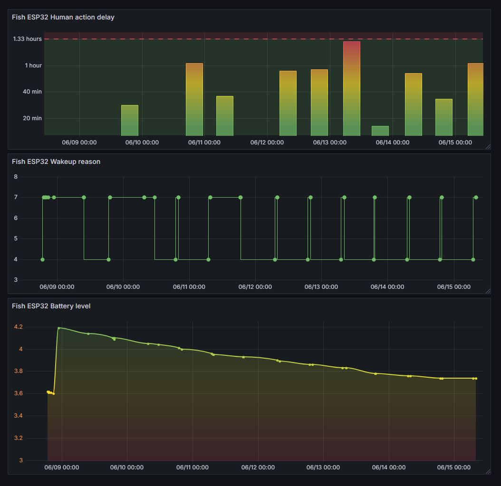

# GrafanaMqttLink

GrafanaMqttLink is a Dockerized solution for real-time data visualization, connecting MQTT data streams to Grafana via Telegraf and InfluxDB. It enables seamless monitoring of IoT or sensor data by processing MQTT messages, storing them in InfluxDB, and visualizing them in Grafana dashboards.

mqtt (local host) <-> telegraf -> influxdb <-> grafana

## Screenshot



## Overview

The project implements the following data chain:
- **MQTT**: Receives real-time data from MQTT topics (local host).
- **Telegraf**: Collects and processes MQTT messages, forwarding them to InfluxDB.
- **InfluxDB**: Stores the processed data for efficient querying.
- **Grafana**: Visualizes the data through customizable dashboards.

This setup is ideal for IoT applications, sensor monitoring, or any use case requiring real-time data visualization.

## Features

- Fully Dockerized for easy deployment.
- Real-time data flow from MQTT to Grafana.
- Scalable and configurable for various IoT scenarios.
- Lightweight and efficient data processing.

## Prerequisites

- [Docker](https://www.docker.com/get-started)
- [Docker Compose](https://docs.docker.com/compose/install/)

## Installation

1. **Clone the Repository**:
   ```bash
   git clone https://github.com/neoxnitro/GrafanaMqttLink-.git
   cd GrafanaMqttLink-
   docker-compose up --remove-orphans --force-recreate -d

2. Web Acess
   - Grafana : ip:3000
   - InfluxDB: ip:8086
   - telegraf: no web ui
